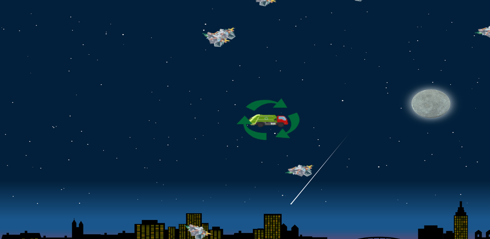

<h2 align="center">Nature_ultimate</h2>

___

  
   
  

___

<h3 align="center">
  <a href="#information_source-sobre">Sobre</a>&nbsp;|&nbsp;
  <a href="#interrobang-motivo">Motivo</a>&nbsp;|&nbsp;
  <a href="#seedling-requisitos-mínimos">Requisitos</a>&nbsp;|&nbsp;
  <a href="#rocket-tecnologias-utilizadas">Tecnologias</a>&nbsp;|&nbsp;
</h3>

___

## :information_source: Sobre

Conscientização sobre o lixo jogado no mundo.

## :interrobang: Motivo

Atividade prática supervisionada.

## :seedling: Requisitos Mínimos

- Java.
- Bluej.
- libGDX.

## :rocket: Tecnologia Utilizada

O projeto foi desenvolvido utilizando a seguinte tecnologia

- Java

